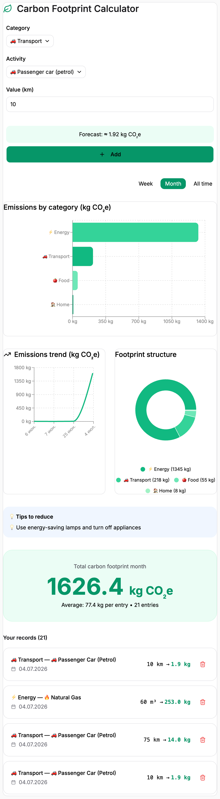

# @ecotrackr/co2-calculator

<div align="center">


**Carbon Footprint Calculator Component for React**

[](https://www.npmjs.com/package/@ecotrackr/co2-calculator)
[](https://react.dev/)
[](https://www.typescriptlang.org/)
[](https://supabase.com/)
[](LICENSE)
[](https://vitest.dev/)

</div>

## Description

A powerful, beautifully designed CO₂ calculator component for React applications. Track your carbon footprint across multiple categories including transport, food, energy, shopping, home, and lifestyle.

Built with ❤️ for EcoTrackr, but ready to use in any React project.

## Features

- **6 Emission Categories** — Transport, Energy, Food, Shopping, Home & Lifestyle
- **Interactive Charts** — Bar, Line & Pie charts with real-time updates
- **Multi-language Support** — Built-in i18n with English & Russian
- **Dark Mode Ready** — Fully compatible with dark/light themes
- **Responsive** — Works on all screen sizes
- **Beautiful Animations** — Smooth transitions with Framer Motion
- **50+ Emission Factors** — Accurate CO₂ calculations
- **Pollution Effect** — Visual feedback on CO₂ addition
- **Trend Analysis** — Track your emissions over time
- **Category Insights** — Personalized reduction tips

## Installation

### Using npm

```bash
npm install @ecotrackr/co2-calculator
```

### Using yarn

```bash
yarn add @ecotrackr/co2-calculator
```

### Using pnpm

```bash
pnpm add @ecotrackr/co2-calculator
```

## Peer Dependencies

Make sure you have these installed in your project:

```json
{
  "react": "^18.0.0",
  "react-dom": "^18.0.0",
  "recharts": "^2.0.0",
  "lucide-react": "^0.200.0",
  "framer-motion": "^10.0.0"
}
```

Install all at once:

```bash
npm install react react-dom recharts lucide-react framer-motion
```

## Quick Start

```tsx
import { CO2Calculator } from '@ecotrackr/co2-calculator';
import { useTranslation } from 'react-i18next';
import { supabase } from '@/lib/supabase';

function App() {
  const { t } = useTranslation('common');

  return (
    <CO2Calculator
      supabase={supabase}
      t={t}
      onEntryAdded={(entry) => console.log('New entry:', entry)}
      onError={(error) => console.error(error)}
    />
  );
}
```

The component expects a Supabase table named `footprint_entries` and an authenticated user session.

## API Reference

### Props

| Prop | Type | Required | Description |
|------|------|----------|-------------|
| `supabase` | `SupabaseClient` | ✅ | Supabase client instance for data persistence |
| `t` | `(key: string, options?: any) => string` | ✅ | i18n translation function |
| `onEntryAdded` | `(entry: Entry) => void` | ❌ | Callback when a new entry is added |
| `onEntryDeleted` | `(id: string) => void` | ❌ | Callback when an entry is deleted |
| `onError` | `(error: Error) => void` | ❌ | Callback when an error occurs |
| `className` | `string` | ❌ | Additional CSS classes |

### Types

```typescript
interface Entry {
  id: string;
  user_id: string;
  category: string;
  activity: string;
  value: number;
  co2e: number;
  date: string;
  created_at: string;
}

interface Category {
  value: string;
  label: string;
  icon: React.ComponentType;
  color: string;
}

interface CategoryData {
  name: string;
  value: number;
  color: string;
}
```

### Exports

The package also exports utilities and hooks for custom integrations:

```typescript
import {
  CO2Calculator,
  useCO2Calculator,
  emissionFactors,
  calculateCO2,
  getEmissionFactor,
  getTips,
} from '@ecotrackr/co2-calculator';
```

## Screenshots

<div align="center">

<picture>
  <source media="(prefers-color-scheme: dark)" srcset="assets/screenshot-dark.png">
  
</picture>

*Dashboard with entry form, charts, and records — adapts to your system theme (light / dark)*

</div>

## Development

### Setup

```bash
# Clone the repository
git clone https://github.com/Julie-Trifonova/co2-calculator.git
cd co2-calculator

# Install dependencies
npm install

# Build in watch mode
npm run dev

# Build for production
npm run build

# Run tests
npm test
```

### Project Structure

```
co2-calculator/
├── assets/
│   ├── screenshot-light.png
│   └── screenshot-dark.png
├── favicon.ico
├── favicon-32x32.png
├── favicon-16x16.png
├── src/
│   ├── components/
│   │   ├── CO2Calculator.tsx
│   │   └── CO2Calculator.test.tsx
│   ├── hooks/
│   │   └── useCO2Calculator.ts
│   ├── utils/
│   │   ├── emissionFactors.ts
│   │   └── calculations.ts
│   ├── types/
│   │   └── index.ts
│   └── index.ts
├── vitest.config.ts
├── vitest.setup.ts
├── package.json
├── tsconfig.json
├── README.md
└── LICENSE
```

## Internationalization

Add translations for your language in `public/locales/en/common.json`:

```jsonc
{
  "carbon_footprint_calculator": "Carbon Footprint Calculator",
  "category_transport": "Transport",
  "category_energy": "Energy",
  "category_food": "Food",
  "category_shopping": "Shopping",
  "category_home": "Home",
  "category_lifestyle": "Lifestyle"
}
```

## Supported Activities

The calculator includes emissions factors for:

### Transport

- Petrol/Diesel/Hybrid/Electric cars
- Short/Long flights
- Train, Bus, Metro
- Bicycle, Walking

### Food

- Beef, Lamb, Pork, Chicken
- Fish, Cheese, Eggs, Milk
- Vegetables, Fruits, Grains
- Coffee

### Energy

- Electricity, Gas
- Heating Oil, Coal
- Solar

### Shopping

- Clothes, Shoes
- Electronics (small/large)
- Furniture, Plastic, Paper

### Home

- Water, Waste
- Recycling
- Heating, Air Conditioning

### Lifestyle

- Streaming
- Online Shopping
- Restaurant, Hotel

## Configuration

### Emission Factors

You can customize emission factors:

```typescript
import { emissionFactors } from '@ecotrackr/co2-calculator';

// Override specific factors
emissionFactors.transport.car_electric.factor = 0.03;
```

### Custom Styling

Pass additional classes via the `className` prop. The component uses Tailwind CSS utility classes and supports dark mode via `dark:` variants.

## Testing

```bash
# Run tests
npm test

# Run tests with coverage
npm test -- --coverage

# Watch mode
npm test -- --watch
```

## Contributing

We welcome contributions! Please follow these steps:

1. Fork the repository
2. Create a feature branch: `git checkout -b feature/amazing-feature`
3. Commit your changes: `git commit -m 'feat: add amazing feature'`
4. Push to the branch: `git push origin feature/amazing-feature`
5. Open a Pull Request

### Conventional Commits

We use [Conventional Commits](https://www.conventionalcommits.org/):

| Prefix | Description |
|--------|-------------|
| `feat:` | New feature |
| `fix:` | Bug fix |
| `docs:` | Documentation |
| `style:` | Code style |
| `refactor:` | Code refactoring |
| `perf:` | Performance improvements |
| `test:` | Tests |
| `chore:` | Maintenance |

### Release Process

```bash
# Patch release (1.0.0 -> 1.0.1)
npm run release:patch

# Minor release (1.0.0 -> 1.1.0)
npm run release:minor

# Major release (1.0.0 -> 2.0.0)
npm run release:major

# Push with tags
git push --follow-tags
```

## License

This project is licensed under the MIT License — see the [LICENSE](LICENSE) file for details.

## Acknowledgments

- Built with [React](https://react.dev/)
- Charts by [Recharts](https://recharts.org/)
- Icons by [Lucide](https://lucide.dev/)
- Animations by [Framer Motion](https://www.framer.com/motion/)
- I18n by [i18next](https://www.i18next.com/)

## Support

- **Email:** support@ecotrackr.com
- **Issues:** [GitHub Issues](https://github.com/Julie-Trifonova/co2-calculator/issues)
- **Discussions:** [GitHub Discussions](https://github.com/Julie-Trifonova/co2-calculator/discussions)

<div align="center">

Made with 💚 for a greener planet

</div>
